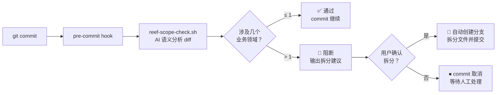

# 分支范围检查 (Branch Scope Validation)

在 `git commit` 和 CI/PR 时自动检测当前分支是否涉及多个业务领域，阻止跨领域提交，并提供自动拆分能力。

## 工作原理



## 命令清单

### 检查分支范围

```bash
# 方式1: 自动获取当前分支与 main 的 diff
bash packages/reef/hooks/reef-scope-check.sh

# 方式2: 指定基准分支
bash packages/reef/hooks/reef-scope-check.sh --diff-from develop

# 方式3: 从 stdin 传入 diff
git diff main...HEAD | bash packages/reef/hooks/reef-scope-check.sh
```

### 门禁检查（阻断式）

```bash
# 本地 commit 检查（exit code 2 = 多领域）
bash packages/reef/hooks/reef-scope-gate.sh

# CI 模式
bash packages/reef/hooks/reef-scope-gate.sh --ci
```

### 安装与卸载

```bash
# 安装 pre-commit hook（git commit 时自动检查）
bash packages/reef/hooks/reef-scope-setup.sh install

# 查看安装状态
bash packages/reef/hooks/reef-scope-setup.sh status

# 卸载
bash packages/reef/hooks/reef-scope-setup.sh uninstall
```

### 分支拆分

```bash
# 分析并拆分多领域分支
bash packages/reef/hooks/reef-scope-split.sh
```

## 配置文件

安装后生成 `.deepstorm/scope-config.json`：

```json
{
  "enabled": true,
  "ciEnabled": true,
  "domains": []
}
```

- `enabled`: 本地 commit 门禁开关
- `ciEnabled`: CI 门禁开关（独立控制）
- `domains`: 项目业务领域列表（空 = AI 自由分类，非空 = AI 对齐到这些领域）

## 使用流程

1. **安装**: 运行一次 `reef-scope-setup.sh install`
2. **日常开发**: 正常 `git commit`，多领域时自动阻断
3. **被阻断时**: 查看拆分建议 → `reef-scope-split.sh` → 确认 → 自动拆分
4. **CI 集成**: 在 CI 流程中调用 `reef-scope-ci.sh`

## CI 集成示例

### GitHub Actions

```yaml
- name: Check branch scope
  run: |
    bash packages/reef/hooks/reef-scope-ci.sh --diff-from ${{ github.base_ref }}
```

### GitLab CI

```yaml
scope-check:
  script:
    - bash packages/reef/hooks/reef-scope-ci.sh --diff-from $CI_MERGE_REQUEST_TARGET_BRANCH_NAME
```

## 环境变量

| 变量 | 默认值 | 说明 |
|------|--------|------|
| `ANTHROPIC_API_KEY` | — | Claude API Key（优先使用） |
| `OPENAI_API_KEY` | — | OpenAI API Key（备选） |
| `LLM_MODEL` | `claude-sonnet-4-20250514` | 使用的模型 |
| `MAX_DIFF_CHARS` | 20000 | diff 截断字符数 |

## 常见问题

**Q: 我不想在所有项目上都启用这个检查？**
A: 每个项目独立安装和配置，`scope-config.json` 中的 `enabled: false` 可关闭。

**Q: 我改了文档也要被阻断吗？**
A: 不会。文档（markdown、README 等）变更会被归类为 `documentation` 领域，不计入多领域阻断判断。

**Q: 没有 API Key 怎么办？**
A: 工具会 fallback 到跳过模式，不阻断提交但输出提示消息。

**Q: 拆分后原来分支的未提交变更还在吗？**
A: 会先自动 stash 备份，拆分执行完成后恢复。
