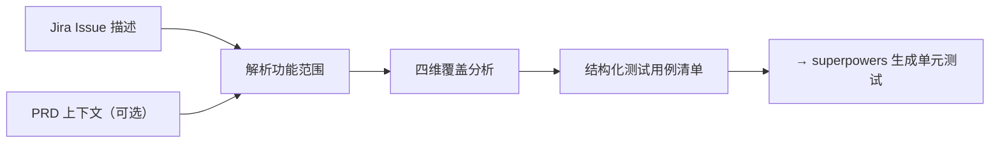

# Test Case Generation

## 功能概述

根据 Jira Issue 描述和可选的 PRD 上下文，生成结构化测试用例清单。

**核心理念：** 测试用例不是最终产出，而是开发过程的"脚手架"——帮助开发者和 AI 想清楚边界条件、异常场景、验收标准，从而产出更高质量的代码和单元测试。

### 工作流



---

## 使用方式

| 方式 | 说明 | 示例 |
|------|------|------|
| **提供功能描述**（推荐） | 直接描述功能，自动解析生成 | "帮我生成注册功能的测试用例：邮箱+密码+验证码注册" |
| **Jira + PRD** | 附上 PRD 链接获取更全面覆盖 | "Jira LC-1234：用户注册。PRD 说支持国际手机号，验证码 5 分钟有效" |
| **Jira ID 参考** | 仅提 ID，引导补充描述 | "为 LC-1234 生成测试用例"（需用户补充描述） |

---

## 工作流

### 步骤 1：输入收集

#### 1.1 获取 Jira Issue 描述

从用户输入中提取功能描述。完整描述直接解析使用；Issue ID 引导补充；简短描述按原文处理。提取**功能范围**、**用户故事**、**验收标准**。

#### 1.2 获取 PRD 上下文（可选）

从 PRD 提取需求背景、业务规则、约束条件、非功能需求，与 Jira 描述合并形成完整输入。无 PRD 时仅基于 Jira 描述生成，输出标注"上下文受限"。

#### 1.3 需求澄清

针对模糊点向用户提问：核心用户？边界条件/限制？已知异常场景？

---

### 步骤 2：四维覆盖分析

基于收集到的输入，按以下四个维度分析测试覆盖：

| 维度 | 分析目标 | 来源 |
|------|---------|------|
| **正常流程** | 用户按预期操作的完整成功路径 | Jira 功能描述中的主要用户场景 |
| **边界条件** | 输入值、状态或数据的极限条件 | 规格中的限制、约束、最大/最小值 |
| **异常场景** | 出错的路径、故障、非预期操作 | 错误处理、网络超时、权限不足、数据不存在 |
| **验收标准验证** | 逐条验证定义的验收条件 | PRD/Jira 中的 AC 列表 |

**覆盖度要求：** 至少覆盖三个维度（必须包含"正常流程"和"验收标准"）。

---

### 步骤 3：结构化测试用例生成

#### 3.1 格式规范

每个测试用例包含以下字段：

| 字段 | 必填 | 说明 |
|------|------|------|
| `ID` | 是 | 唯一标识，格式 `TC-{feature}-{seq}` |
| `类型` | 是 | 正常流程 / 边界条件 / 异常场景 / 验收标准 |
| `前置条件` | 是 | 测试所需的前置状态或数据 |
| `测试步骤` | 是 | 清晰的操作步骤描述 |
| `预期结果` | 是 | 期望的行为或输出 |
| `关联验收标准` | 否 | 对应 PRD 或 Jira 中的验收标准编号 |

#### 3.2 输出结构

```markdown
## 测试用例清单

**功能：** {feature name}
**来源：** {Jira Issue ID}
**PRD 上下文：** {PRD link / "无"}

---

### 正常流程

{正常流程测试用例列表}

### 边界条件

{边界条件测试用例列表}

### 异常场景

{异常场景测试用例列表}

### 验收标准验证

{验收标准测试用例列表}

---

> **superpowers 提示：** 以上测试用例清单可作为 superpowers 的输入，辅助生成更完备的单元测试。建议将本段内容复制到开发提示中作为上下文。
```

#### 3.3 特殊处理

无 PRD → 标注"上下文受限，覆盖仅限于 Jira Issue 描述"；无验收标准 → 跳过该维度并标注；单维度用例 ≤ 10 条。

---

## 关键原则

- **按需生成**：开发过程中调用，非批量输出
- **人工 Review**：AI 产出框架，人工审核补充
- **开发侧内聚**：测试用例是开发脚手架，辅助 superpowers 生成更完备的单元测试

## 字段模板

测试用例字段模板详见 `references/test-case-template.md`。

## 覆盖维度指引

四维覆盖的详细指引和检查清单详见 `references/coverage-dimensions.md`。
