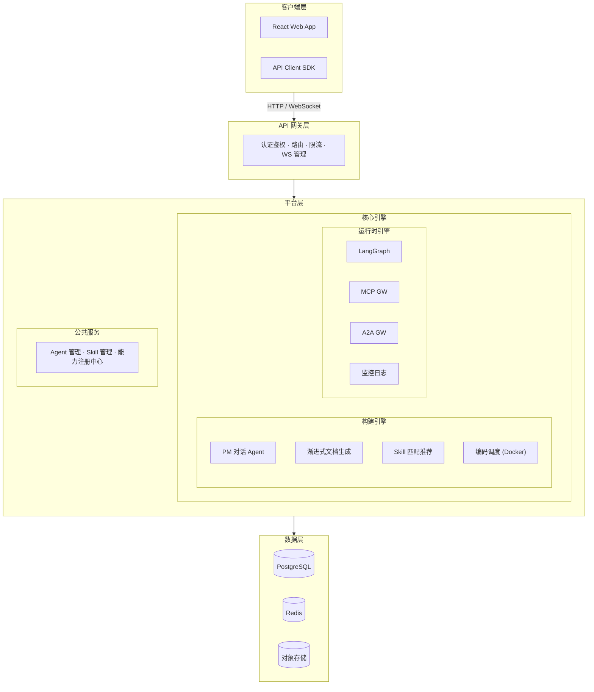

# 星云 · Nebula

> **星云深处，万物始生。**
> *Where stars are born.*

**星云 (Nebula)** 是 AI Agent 中台平台——把业务需求翻译成 Agent 开发指令，调度成熟工具完成交付。

---

## 命名由来

星云（Nebula）是天文学中恒星的摇篮——星际气体与尘埃在引力作用下凝聚、坍缩，最终诞生出新的恒星。

这与星云平台的使命完美对应：平台是"恒星孕育所"。项目需求就是星云中的原始物质，在平台的引力下凝聚成型，最终诞生出可独立运行的代码——一颗颗"恒星"。

---

## 核心定位

**AI Agent 中台** — 一个编排层平台。

- 🎯 **不造轮子** — 对接成熟方案（Claude Code 等），专注调度与编排
- 🎯 **中台之力** — 把业务集中，把人才聚集。所有 agent、skill、工具汇聚于此
- 🎯 **PM 驱动** — 产品经理是平台的一级用户，从需求到交付，无需写代码

---

## 架构概览



### 构建引擎 (Build Engine)

PM 发起需求 → Build Session 贯穿始终：

1. **PM 对话 Agent** — 多轮对话逐步澄清需求（LangGraph StateGraph）
2. **渐进式文档生成** — 增量生成 PRD / 需求文档 / 架构设计 / 验收标准
3. **Skill 匹配** — 智能推荐适合场景的 Skill 模版
4. **编码调度** — Docker + Claude Code 自动完成开发

### 运行时引擎 (Runtime Engine)

Agent 部署后持续运行：

- **runtime-api** — 运行时 API / 对话触发
- **langgraph-cluster** — Agent 执行集群
- **mcp-gateway** — MCP 工具代理，连接外部工具
- **a2a-gateway** — Agent 间通信代理
- **agent-monitor** — 运行时监控 / 日志 / 告警

---

## 关键协议

| 协议 | 用途 | 位置 |
|------|------|------|
| **MCP** | 外部工具接入标准 | MCP Registry + MCP Gateway |
| **A2A** | Agent 间通信 | A2A Registry + A2A Gateway |

---

## 技术栈

| 层 | 技术 |
|------|------|
| 前端 | React |
| Agent 引擎 | LangGraph |
| 后端 | Python |
| 数据库 | PostgreSQL, Redis |
| 执行环境 | Docker (v1) → A2A (v2) |

---

## 快速开始

### 前置条件

- **Python 3.11+**（推荐 3.12）
- **Node.js 18+**（推荐 20 LTS）
- **uv** — Python 包管理工具 [`curl -LsSf https://astral.sh/uv/install.sh | sh`]
- **pnpm** — 前端包管理工具 [`corepack enable && corepack prepare pnpm@latest --activate`]
- [Claude Code](https://docs.anthropic.com/en/docs/claude-code/overview)（编码执行器使用，可选）

### 一键启动（推荐）

```bash
# 一键完成环境初始化、依赖安装、数据库迁移、服务启动
make dev
# 或直接运行
./scripts/start.sh
```

启动后：
- 后端 API → http://localhost:8000
- API 文档 → http://localhost:8000/docs
- 前端 → http://localhost:5173

按 `Ctrl+C` 停止所有服务。

### 分步启动（可选）

```bash
# 1. 后端
cd packages/build-engine/backend
cp .env.example .env        # 编辑 .env 修改 JWT Secret 等
uv sync                      # 安装依赖
uv run alembic upgrade head  # 数据库迁移
uv run python seed.py        # 初始化内置用户
uv run uvicorn app.main:app --reload --port 8000 &

# 2. 前端
cd packages/build-engine/frontend
pnpm install                 # 安装依赖
pnpm run dev                 # 启动开发服务器 (http://localhost:5173)
```

### Docker 部署（生产）

```bash
# 构建并启动 build-engine 服务
make build-engine   # 构建镜像
make up-engine      # 启动容器 (http://localhost:80)
make down-engine    # 停止容器
```

或直接操作 Compose：

```bash
cd docker
docker compose up -d
```

### 访问平台

打开 http://localhost:5173（开发）或 http://localhost:80（Docker），使用以下内置账号登录：

| 角色 | 用户名 | 密码 | 权限说明 |
|------|--------|------|---------|
| 管理员 | `admin` | `123456` | 全部权限（含删除项目） |
| 产品经理 | `pm` | `123456` | 使用平台，创建对话和项目 |

### 校验是否启动成功

```bash
# 后端应返回 401（未认证，说明服务正常）
curl http://localhost:8000/api/v1/auth/me -H "Authorization: Bearer test" -w "\nHTTP %{http_code}"

# 前端应在浏览器打开 http://localhost:5173 看到登录页
```

### 常见问题

| 问题 | 解决 |
|------|------|
| `uv` 未找到 | `curl -LsSf https://astral.sh/uv/install.sh | sh` |
| `pnpm` 未找到 | `corepack enable && corepack prepare pnpm@latest --activate` |
| 数据库迁移报错 | 确保在 `packages/build-engine/backend/` 目录下，且 `.env` 已创建 |
| 后端启动失败 | 检查端口 8000 是否被占用，`.env` 配置是否正确 |
| 前端请求后端 502 | 后端未就绪，等几秒后刷新页面 |
| `port 5173 already in use` | `pnpm run dev -- --port 5174` |
| SQLite 数据库位置 | 默认在 `packages/build-engine/backend/nebula.db` |

---

## 文档

- [平台架构设计](docs/agents/platform-architecture.md) — 完整架构文档
- [ADR 记录](docs/adr/) — 架构决策记录

---

## 愿景

> **让每个产品经理都拥有一支 Agent 军团。**
>
> 星云不造轮子，它让轮子转起来。当复杂的开发工作被结构化、标准化、自动化，产品经理将不再受制于开发排期。需求的尽头就是交付——这就是星云的力量。

---

<p align="center">⭐ 星云深处，万物始生 ⭐</p>
