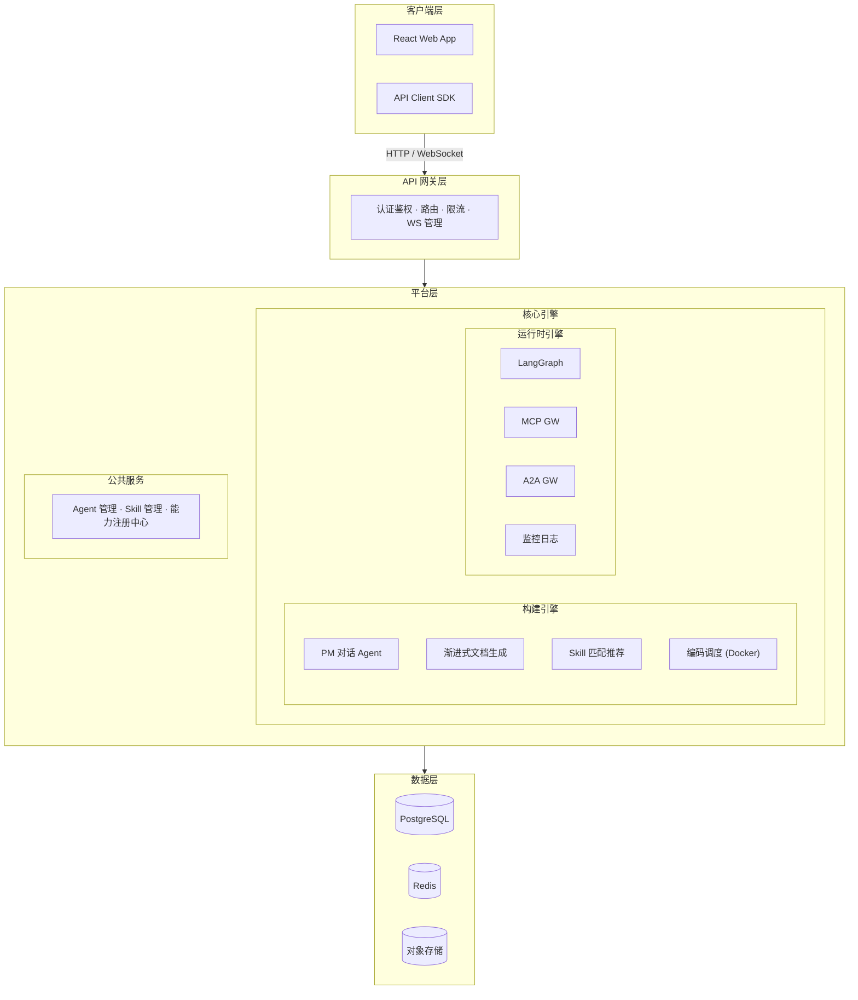

# 星云 · Nebula

> **星云深处，万物始生。**
> *Where stars are born.*

**星云 (Nebula)** 是 AI Agent 中台平台——把业务需求翻译成 Agent 开发指令，调度成熟工具完成交付。

---

## 命名由来

星云（Nebula）是天文学中恒星的摇篮——星际气体与尘埃在引力作用下凝聚、坍缩，最终诞生出新的恒星。

这与星云平台的使命完美对应：平台是"恒星孕育所"。项目需求就是星云中的原始物质，在平台的引力下凝聚成型，最终诞生出可独立运行的代码——一颗颗"恒星"。

最初选择的是"天枢（Polaris）"——北极星，万物围绕它旋转。但星云平台的本质不是中心引力，而是创造与诞生。星云纠正了这个概念：不是让星星绕它转，而是让星星从它里面生。

---

## 核心定位

**AI Agent 中台** — 一个编排层平台。

- 🎯 **不造轮子** — 对接成熟方案（Claude Code 等），专注调度与编排
- 🎯 **中台之力** — 把业务集中，把人才聚集。所有 agent、skill、工具汇聚于此
- 🎯 **PM 驱动** — 产品经理是平台的一级用户，从需求到交付，无需写代码

---

## 架构概览



### 构建引擎 (Build Engine)

PM 发起需求 → Build Session 贯穿始终：

1. **PM 对话 Agent** — 多轮对话逐步澄清需求（LangGraph StateGraph）
2. **渐进式文档生成** — 增量生成 PRD / 需求文档 / 架构设计 / 验收标准
3. **Skill 匹配** — 智能推荐适合场景的 Skill 模版
4. **编码调度** — Docker + Claude Code 自动完成开发

### 运行时引擎 (Runtime Engine)

Agent 部署后持续运行：

- **runtime-api** — 运行时 API / 对话触发
- **langgraph-cluster** — Agent 执行集群
- **mcp-gateway** — MCP 工具代理，连接外部工具
- **a2a-gateway** — Agent 间通信代理
- **agent-monitor** — 运行时监控 / 日志 / 告警

---

## 关键协议

| 协议 | 用途 | 位置 |
|------|------|------|
| **MCP** | 外部工具接入标准 | MCP Registry + MCP Gateway |
| **A2A** | Agent 间通信 | A2A Registry + A2A Gateway |

---

## 技术栈

| 层 | 技术 |
|------|------|
| 前端 | React |
| Agent 引擎 | LangGraph |
| 后端 | Python |
| 数据库 | PostgreSQL, Redis |
| 执行环境 | Docker (v1) → A2A (v2) |

---

## 快速开始

_Coming soon..._

```bash
# 启动开发环境
# TODO
```

---

## 文档

- [平台架构设计](docs/agents/platform-architecture.md) — 完整架构文档
- [ADR 记录](docs/adr/) — 架构决策记录

---

## 愿景

> **让每个产品经理都拥有一支 Agent 军团。**
>
> 星云不造轮子，它让轮子转起来。当复杂的开发工作被结构化、标准化、自动化，产品经理将不再受制于开发排期。需求的尽头就是交付——这就是星云的力量。

---

<p align="center">⭐ 星云深处，万物始生 ⭐</p>
