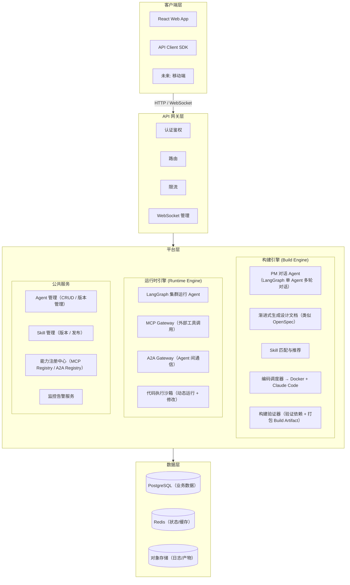

# 星云 · Nebula — AI Agent 中台 平台架构设计

> 更新日期：2026-07-06
> 讨论参与者：Bill、Claude

---

## 1. 平台定位

**Harness Agent** — 一个编排层平台，不造轮子。

- 核心价值：把业务需求翻译成 Agent 开发指令，调度专业工具完成编码
- 输出 **可独立运行的代码**，而非平台锁定的配置产物
- 不自己实现代码生成能力，而是对接成熟方案（Claude Code 等）
- 对内服务特定业务场景，Skill 由内部开发团队生产

### 1.1 竞品分析与差异化

#### 当前市场格局（2026）

| 类别 | 代表平台 | 定位 | 使用者 | 产出物 |
|------|---------|------|--------|--------|
| 可视化 Agent 构建 | Dify、Coze、AutoGPT、LangFlow | Low-code Agent 搭建 | 非技术/技术用户 | 平台内 Agent 配置 |
| 多 Agent 框架 | LangGraph、CrewAI、OpenAI Agents SDK | 代码级编排 | 开发者 | 代码 |
| 编码 Agent | Claude Code、Cursor、Devin | 自主编码 | 开发者 | 代码 |
| 企业全栈平台 | LangSmith Fleet、Copilot Studio | 全生命周期治理 | 企业团队 | Agent + 托管 |

#### 星云的差异化生态位

| 维度 | 现有平台 | 星云 (Nebula) |
|------|---------|----------------|
| **使用者** | 开发者（写代码/拖配置） | **产品经理**（讲需求/传 PRD） |
| **输入** | 技术配置、Prompt 编写 | **自然语言需求 / PRD** |
| **核心能力** | 编排 Agent、构建 Agent | **翻译需求 → Agent 开发指令** |
| **产出的抽象级别** | Agent 逻辑图/配置 JSON | **结构化设计文档 + 可运行代码** |
| **对编码工具的态度** | 自带 Agent / 平台内运行 | **调度外部工具**（不造轮子） |
| **产出物形态** | 平台内 Agent（锁定） | **独立代码库**（可 Git 管理、可部署） |
| **修改方式** | 回平台改配置 | **直接改源码，实时生效** |
| **适用场景** | 搭建 AI 客服/知识库 | **开发完整的业务系统** |

#### 一句话定位

> **别人的平台是"给开发者造 Agent 的工具"，星云是"给产品经理调度 Agent 军团的指挥台"。**

#### 三种输入模式

```
┌─ 模式 A：PM 上传 PRD ────────────────────────────┐
│  PM 提供完整 PRD → 平台解析 → 讨论澄清 → 文档 → 编码    │
│  PRD 提供丰富业务上下文，但平台仍需帮 PM 发现矛盾/模糊点   │
└────────────────────────────────────────────────────┘

┌─ 模式 B：PM 只带一个想法 ───────────────────────────┐
│  对话 → 需求澄清 → 生成 proposal → 确认 → 文档 → 编码 │
└────────────────────────────────────────────────────┘

┌─ 模式 C：已有项目迭代 ──────────────────────────────┐
│  进入项目 → 加载历史文档 → 讨论新需求 → 增量更新 → 编码  │
└────────────────────────────────────────────────────┘
```

文档不是为了替代 PRD，而是为了让 AI 更好地理解业务上下文，生成更高质量的代码。

---

## 2. 整体分层架构



---

## 3. 构建引擎 (Build Engine)

### 3.1 生命周期

#### Session 模型

```
用户登录 → 项目列表 → 进入项目 → 加载项目历史文档（proposal + design）
                    → 继续对话 / 发新需求

用户登录 → 无项目 → 新会话（"新项目"） → 新需求
```

核心关系：

```
User 1:N Project 1:N Session
                   1:1 BuildProcess（文档/编码执行）
```

- Project 是需求的 **容器**，承载一个业务场景的完整生命周期
- Session 是 **对话工作区**，每次进入项目新建或复用 Session
- 进入项目时，加载该项目的历史 **proposal 和 design 文档**到上下文，确保 LLM 理解前情
- 代码生成本身需要分钟级时间（编译、测试、部署），用户有等待预期，关键是通过 **Pipeline 进度可视化**让用户知道进展

### 3.2 PM 对话 Agent

采用 **单 Agent 多轮对话**，不拆分子 Agent。

- 基于 LangGraph 的 `StateGraph`
- State 中维护 messages 和逐步填充的业务信息
- 不需要专门的子 Agent 来处理每个信息缺口，一个 Agent 通过多轮对话即可完成
- 输入方式灵活：支持 PM 上传 PRD → 解析讨论，也支持从零开始对话澄清

### 3.3 文档生成流程（类似 OpenSpec）

**对话结束后**统一生成/更新设计文档。对话过程专注需求澄清，不干扰讨论节奏；需求厘清后再沉淀为结构化文档。

文档持久化到对象存储/DB：

```
项目ID/
  ├── proposal.md     — 需求提案（high-level 业务目标）
  ├── requirements.md — 详细需求
  ├── design.md       — 设计方案
  └── acceptance.md   — 验收标准
```

**价值**：
- 后续改需求时，LLM 加载旧文档即可理解上下文，不需要从零开始
- 进入项目时仅加载 **proposal + design** 两篇核心文档到上下文
- Markdown 格式天然可读、可 diff、可 Git 版本追踪
- 即使 PM 提供了完整 PRD，文档也作为 AI 理解业务上下文的"桥梁"

### 3.4 编码执行

- 平台负责生成设计文档 + 精确的编码指令
- 调用 **Claude Code** 在 Docker 容器中实际执行开发
- 编码执行器抽象为接口，v1 使用 Docker，未来可扩展 A2A

### 3.5 构建验证与打包（Build Artifact）

#### 背景：Python 不需要传统编译

星云后端技术栈是 Python，生成代码也是 Python。Python 是解释型语言，**源码即运行文件**，不需要类似 Java/Go/Rust 的编译步骤。

因此"构建"在 Python 语境下 = **验证 + 打包**，而非编译：

```
编码完成
  → pip install -r requirements.txt（依赖安装验证）
  → python -c "from app import main"（模块导入检查）
  → 运行单元测试/E2E 测试
  → 打包：源码 + requirements.txt + Dockerfile + 部署配置
  → 产出 Build Artifact（版本化）
```

#### 构建 Docker 容器

与编码 Docker 容器分离，生命周期和目标不同：

| | 编码容器 | 构建容器 |
|------|---------|---------|
| 职责 | Claude Code 写代码、调试 | 验证依赖、测试、打包 |
| 镜像 | 大（含 SDK、开发工具） | 小（alpine + Python） |
| 生命周期 | 分钟级（编完即销毁） | 秒级（跑完即销毁） |

#### Build Artifact 的结构

每个版本化的 Artifact 包含：

```
artifacts/<project-id>/<version>/
  ├── src/                     ← 生成的业务源码
  ├── requirements.txt         ← 依赖声明
  ├── Dockerfile               ← 运行镜像定义
  ├── docker-compose.yml       ← 可选：服务编排（含三方服务）
  ├── agent-config.yml         ← 可选：Agent 图定义
  └── manifest.json            ← 版本号、入口、依赖声明
```

#### 完整 Build Pipeline

```
需求已接收 → 文档生成 → Skill 匹配 → 编码执行(Claude Code)
  → 单元测试 → E2E 测试 → 构建验证与打包(构建容器) → Build Artifact
                                                          ↓
                                                    Artifact Registry
                                                    (带版本、可回退)
```

### 3.6 编码反馈回路

编码并非总能一次成功。Claude Code 可能遇到编译错误、测试不通过、或生成逻辑不符合预期。需要设计反馈回路：

#### CodingResult 状态机

```
编码执行 → 结果判断
  ├── success                 → 继续构建流程
  ├── retryable_failure       → 自动重试（限 N 次，N=3）
  ├── needs_clarification     → 回退到 PM 对话 Agent（"需要你确认：X 部分有冲突，请说明"）
  └── fatal                   → 终止 Pipeline，通知 PM
```

- **retryable_failure**：Claude Code 报错、测试未通过、代码有语法问题 → 自动重试，每次附带前次错误信息
- **needs_clarification**：PM 对话 Agent 介入，用自然语言询问 PM 决策，然后重新进入编码步骤
- **fatal**：超出重试次数、架构级冲突无法自动解决 → 终止 Pipeline，PM 收到通知和原因

#### 可视化

Pipeline 中的每个节点状态实时展示在"构建流水线"视图里：
- ⏳ 等待中
- 🔄 执行中
- ✅ 成功
- ⚠️ 重试中（显示第 N 次）
- ❌ 失败（显示原因，可点击展开详情）

### 3.7 交付验收闭环

构建完成后，PM 需要确认"这就是我想要的"，而不是平台丢出一堆代码就不管了。

#### 验收流程

```
Build Artifact 产出完毕
  → 自动部署到沙箱环境
  → PM 在浏览器中直接看到运行效果
  → PM 确认 ✓ / 驳回 ✗
    ├── 确认 → Artifact 标记为"可交付"，进入 Artifact Registry
    └── 驳回 → 回退到 PM 对话 Agent（"请说明问题：_______"）
               → PM 描述 → 重新编码 → 重新构建
```

#### PM 视角的流程图

```
PM 提需求 → 对话澄清（可选） → Pipeline 跑起来（进度可视化）
  → 沙箱预览 → 确认验收 → 产出版本化 Artifact（可交付）
```

#### Artifact 的版本管理

- 每次构建产出一个版本化的 Artifact
- Artifact Registry 保存所有历史版本
- PM / 客户可以回退到任意历史版本
- 每个 Artifact 包含对应的 SDD 文档快照（验收时锁定设计文档版本）

### 3.8 项目目录结构

nebula-platform 为每个项目创建一个文件目录，存放该项目的所有设计文档和源代码：

```
projects/<project-id>/
  ├── sdd/                          ← 设计文档（Software Design Document）
  │   ├── proposal.md               ← 需求提案
  │   ├── requirements.md           ← 详细需求
  │   ├── design.md                 ← 设计方案
  │   └── acceptance.md             ← 验收标准
  ├── src/                          ← 生成的源代码
  ├── requirements.txt              ← 依赖声明
  ├── Dockerfile                    ← 运行镜像定义
  └── .nebula.yml                  ← 项目元信息（project 配置、当前 Artifact 版本）
```

- SDD 目录随对话推进逐步生成（但写入动作在对话结束后统一触发）
- `src/` 在编码执行阶段由 Claude Code 生成，构建容器验证后打包为 Artifact
- `.nebula.yml` 是项目配置文件，记录项目元信息、关联的 Artifact 版本列表

---

## 4. 运行时引擎 (Runtime Engine)

### 4.1 定位

- 生命周期：Agent 部署后持续运行，直到被下线
- 部署形态：弹性集群，可扩缩容
- 底层：LangGraph 集群

### 4.2 服务组成

| 服务 | 职责 |
|------|------|
| runtime-api | 运行时 API（对话/触发） |
| langgraph-cluster | Agent 执行引擎 |
| mcp-gateway | MCP 工具代理 |
| a2a-gateway | Agent 间通信代理 |
| code-sandbox | 代码动态运行沙箱（支持用户在线修改源码） |
| agent-monitor | 运行时监控 / 日志 |

### 4.3 代码沙箱规范

沙箱是 nebula-runtime 的核心组件之一，用于在浏览器中动态运行生成的业务代码。

#### 运行流程

```
nebula-platform（编码完成 → 构建验证 → 打包 Build Artifact）
  ↓ 版本化 Artifact
nebula-runtime（加载 Artifact → 启动沙箱 → PM 浏览器访问）
```

#### 沙箱能力

| 维度 | 说明 |
|------|------|
| 进程 | 完整进程能力：启动 Web 服务、后台任务、数据库连接 |
| 文件系统 | 临时目录可写，有配额限制 |
| 网络 | 默认禁止外网 → 白名单开放（如 API 调用、数据库连接） |
| CPU/内存 | cgroup 限流 |
| 持久化 | 沙箱重启即清空，不保留状态 |
| 访问方式 | PM 通过浏览器直接访问运行中的沙箱应用 |

#### 安全隔离策略

| 风险 | 应对 |
|------|------|
| 恶意文件读写 | 临时目录 + 配额限制 |
| 网络泄露 | 默认禁止外网，白名单开放 |
| 进程失控 | cgroup 限流 + 超时 kill |
| 持久化污染 | 沙箱重启即清空 |
| 镜像安全 | 构建容器产出的镜像经过依赖验证 |

> 验证流程（测试、构建）在 nebula-platform 的构建容器中完成，nebula-runtime 不做二次验证。
> 但 Artifact 可附带测试脚本，客户侧按需执行 `nebula-runtime verify`。

---

## 5. 两种部署模式：Build Mode vs Run Mode

平台在**开发态**和**运行态**是两个不同的视图。两者作为**两个独立的部署单元**存在，而非同一个平台的不同启动模式。

### 两个独立的代码库

```
├── nebula-platform/     ← 星云平台（完整版，含构建引擎 + 运行时引擎）
│                           内部开发态使用，PM 通过 Web 访问
│
├── nebula-runtime/      ← 运行平台（轻量版，独立可部署）
│                           客户侧部署，仅包含运行时引擎 + 公共服务
│
└── artifacts/            ← 构建产物（项目维度，版本化）
    └── <project-id>/<version>/
        ├── src/                     ← 生成的业务源码
        ├── requirements.txt         ← 依赖声明
        ├── Dockerfile               ← 运行镜像定义
        └── manifest.json            ← 版本号、入口、依赖声明
```

### 开发态（Build Mode）— nebula-platform

```
┌──────────────────────────────────────────┐
│            nebula-platform                │
│                                           │
│  构建引擎    │   运行时引擎                  │
│  (Build)     │   (Runtime)                │
│              │                            │
│  · PM 对话   │  · LangGraph 集群          │
│  · 文档生成  │  · MCP / A2A Gateway      │
│  · Skill匹配 │  · 代码沙箱                │
│  · 编码调度  │  · 代理运行监控             │
│  · 构建验证  │                            │
└──────────────────────────────────────────┘
```

- 构建引擎和运行时引擎**都在 nebula-platform 中**
- PM 通过平台完成需求对话、文档生成、编码调度、构建验证、沙箱修改
- 编码完成后执行构建验证（验证依赖 + 打包），产出版本化的 Build Artifact

### 运行态（Run Mode）— nebula-runtime

```
┌──────────────────────────────────────────┐
│            nebula-runtime                 │
│                                           │
│  ┌─────────────┐  ┌───────────────────┐  │
│  │  运行时引擎   │  │  Build Artifact   │  │
│  │              │  │  （动态加载）      │  │
│  │  LangGraph   │  │                   │  │
│  │  MCP GW      │  │  src/             │  │
│  │  A2A GW      │  │  Dockerfile       │  │
│  └─────────────┘  └───────────────────┘  │
│                                           │
│  ┌──────────────────────────────────┐     │
│  │  公共服务：PostgreSQL / Redis     │     │
│  └──────────────────────────────────┘     │
└──────────────────────────────────────────┘
```

客户拿到的是  `nebula-runtime/`  目录 + 一个版本化的 `Build Artifact`：

```
# 一行命令启动
docker-compose up

# 运行平台自动加载指定版本的 Artifact
# 业务代码即可运行
```

**客户需要的东西：**
- **nebula-runtime** — 我们提供的运行平台（轻量、独立可部署）
- **Build Artifact** — 平台产出的业务代码（版本化、可回退）
- **必要服务** — PostgreSQL、Redis（运行平台带了）

**不需要的东西：**
- nebula-platform（构建引擎、PM 对话、Skill 匹配、编码调度器）
- 星云平台本身

### 客户拿到的绝对干净

nebula-runtime 没有任何构建引擎和平台管理逻辑。运行平台本身可以公开镜像，客户也能自己审计。运行平台的升级不影响已部署的业务代码。

### 意义

- 星云是**工厂**，不是**运行环境**
- 工厂产出的代码**脱离工厂也能运行**
- 客户获得的是**完整的软件资产**，而非平台依赖的配置
- 星云按 Build Session 收费（而非 Runtime 持续计费）

## 6. Agent 复杂度判断

系统自动判断需求对应的 Agent 复杂度：

- **简单** → 单 Agent 即可
- **复杂** → 需要多 Agent 组合

判断逻辑需要提炼为**专门 Prompt**，由构建引擎中的复杂度评估节点执行。

---

## 6. Agent 复杂度判断

系统自动判断需求对应的 Agent 复杂度：

- **简单** → 单 Agent 即可
- **复杂** → 需要多 Agent 组合

判断逻辑需要提炼为**专门 Prompt**，由构建引擎中的复杂度评估节点执行。

---

## 7. Skill 体系

### 7.1 什么是 Skill

Skill 是**系统内部的编码指令模板包**，PM 完全不接触。当 PM 说"做一个用户管理系统"，系统要把这个需求翻译成 Claude Code 能执行的开发指令——Skill 就是这个翻译的中间层。

```
PM 说："帮我做一个用户管理系统"
  ↓
系统匹配到 "user-management" Skill
  ↓
Skill 里装着：
  ├── clarify.md          → 系统应该问 PM 哪些问题来补全信息
  ├── blueprint.md        → 架构蓝图（项目结构、数据模型、API）
  ├── coding-prompt.md    → 给 Claude Code 的精确编码指令
  ├── verify.md           → 验证标准（测试要求、验收条件）
  └── variants/           → 技术栈变体
  ↓
Claude Code 拿到指令 → 开始写代码
```

### 7.2 一个 Skill 的完整结构

| 组件 | 文件 | 说明 |
|------|------|------|
| 元信息 | `skill.yaml` | 名称、适用场景描述、when_to_use |
| 需求澄清模板 | `clarify.md` | 需要向 PM 问哪些问题来补全需求 |
| 架构蓝图 | `blueprint.md` | 目录结构、数据模型、API 设计、数据库表 |
| 编码指令 | `coding-prompt.md` | 给 Claude Code 的 Prompt，含代码风格约束 |
| 验证标准 | `verify.md` | 自动化验证脚本、测试要求、验收条件 |
| 技术栈变体 | `variants/*.yaml` | 同场景不同技术栈（Python / TypeScript）的差异配置 |

### 7.3 MVP 需要创建的 Skill 集合

对标 reef 技能体系，Nebula MVP 至少需要以下核心 Skill：

| Skill | 用途 | P0/P1 |
|-------|------|-------|
| `style-backend` | Python 后端代码风格约束 | P0 |
| `style-frontend` | React 前端代码风格约束 | P0 |
| `gen-service` | 生成 API + 数据层 + 业务逻辑 | P0 |
| `gen-crud` | 生成 CRUD 页面（表单 + 表格 + 详情） | P1 |
| `testcase` | 生成单元测试 / E2E 测试 | P1 |
| `harden` | 安全加固 + 输入校验 | P2 |
| `commit` | commit message / changelog 生成 | P2 |

### 7.4 生产与消费

- **MVP 阶段**：LLM 从对话中提取需求 + 匹配模板自动生成 Skill，人工 refine 后沉淀
- 后续由**内部开发团队**生产高质量 Skill
- **产品经理**只消费 Skill（使用平台推荐的 Skill），不接触 Skill 本身

### 7.5 质量保障

LLM 生成的 Skill 如果不经过验证就直接指导编码，等于"AI 生成指令 → AI 执行指令"的双重不确定叠加。

建议验证流程：

```
LLM 生成 Skill
  → 自动验证：蓝图结构完整性、Node/Tool 引用闭合
  → 自动测试：用此 Skill 跑一个最小示例，验证产出是否可用
  → 人工 review（内部团队确认后才进入生产库）
  → 版本化：上线后支持 A/B 对比、回退
```

### 7.6 编码约束（代码可维护性）

Skill 的 `coding-prompt.md` 中内置以下约束，保证 AI 生成的代码质量和一致性：

- **项目结构规范**：目录约定、模块划分（每次增量修改时先让 AI 读一遍已有代码）
- **代码风格约束**：lint 配置（ruff）、格式化规则
- **必要注释要求**：API 文档、复杂逻辑说明
- **安全红线**：敏感数据处理、输入校验、SQL 注入防范（引用 `harden` Skill）

---

## 8. 关键协议

| 协议 | 用途 | 在平台中的位置 |
|------|------|---------------|
| MCP | 外部工具接入标准 | MCP Registry + MCP Gateway |
| A2A | Agent 间通信 | A2A Registry + A2A Gateway |

---

## 9. 编码执行器 — Docker vs A2A 决策

### 决策结果：**v1 用 Docker，预留 A2A 接口**

| 方案 | 优点 | 缺点 |
|------|------|------|
| Docker | 成熟稳定、环境隔离、资源可控 | 镜像大、冷启动慢 |
| A2A | 架构统一、平台无需管理容器 | 协议早期、网络复杂、控制力弱 |

通过抽象接口解耦：

```python
class CoderBackend(ABC):
    @abstractmethod
    async def execute_development(self, spec: dict, skill: Skill, project_dir: str) -> DevelopmentResult:
        ...

class DockerCoderBackend(CoderBackend): ...   # v1
class A2ACoderBackend(CoderBackend): ...      # v2 可选
```

---

## 10. 数据存储设计

**数据库 + Markdown 文件** 组合存储：

| 存数据库（PostgreSQL） | 存 Markdown 文件（对象存储 / Git） |
|----------------------|---------------------------------|
| 会话列表、用户、项目元信息 | 需求文档（proposal / requirements / design / acceptance）|
| Skill 元数据（名称/版本/标签） | Skill 完整定义（模板/蓝图/Prompt） |
| Agent 实例状态、运行时指标 | 编码产物、日志 |
| 用户权限、配置 | |

结构化数据用 DB 方便查询和关联（"用户有哪些项目"、"某项目的所有会话"），长文本内容用文件方便 LLM 读取和对比 diff。

---

## 11. 前端架构

### 技术栈推荐

```
核心框架: React + TypeScript + Vite
样式方案: Tailwind CSS
组件底座: shadcn/ui（聊天界面/通用组件）
后台页面: Ant Design（管理控制台/CRUD）
图可视化: React Flow（构建流水线/Agent 拓扑）
状态管理: zustand（轻量） + @tanstack/react-query（服务端状态）
```

### 三种视图模式

前端需要支撑三类差异较大的界面：

| 视图 | 组件方案 | 说明 |
|------|---------|------|
| 聊天界面 | shadcn/ui + 手搓 | 类 ChatGPT 的消息列表、对话气泡、输入框 |
| 管理控制台 | Ant Design | CRUD 表格、表单、配置页面 |
| 构建流水线 | React Flow | 构建进度 DAG、Agent 拓扑、实时状态展示 |
| 代码沙箱 | CodeMirror / Monaco Editor | 在线浏览/编辑生成的源代码 |

建议用 **React Router** 做路由组织，zustand 管理聊天/会话全局状态，react-query 管理后端 API 数据。

---

## 12. 测试策略

代码生成完成后，平台自动执行：
- **单元测试** — 验证核心逻辑
- **E2E 测试** — 验证完整流程
- 跑通即通过，MVP 阶段不设覆盖率门槛，后续再增加

---

## 13. 代码沙箱（差异化能力）

星云与 Dify/Coze 的**核心差异**在于：

```
Dify/Coze:   需求 → 拖拖拽拽 → 平台内 Agent（配置产出）
星云:        需求 → 澄清 → 代码生成 → 🏃‍♂️ 动态运行 → 💻 直接编辑修复 → 交付
```

- 平台提供 **代码沙箱**，用户可直接在浏览器中运行生成的代码
- 用户可**直接修改源代码**进行调整，修改实时生效
- 代码即资产：产物是独立可运行的代码库，可 Git 管理、可独立部署
- 不锁定在平台生态——用户随时可以拿代码走

---

## 14. 待讨论问题

### ✅ 已初步确认

- [x] Session 模型：项目粒度，进入项目加载 proposal + design
- [x] 文档生成：对话结束后统一生成，非增量
- [x] 输入模式：支持 PRD 上传 + 零基础对话两种
- [x] 数据模型：PostgreSQL + Markdown 文件组合存储
- [x] 前端组件库：shadcn/ui + Ant Design + React Flow + Tailwind
- [x] 测试策略：单元测试 + E2E 跑通即过
- [x] Skill 生成：MVP 先 LLM 生成，后续人工沉淀
- [x] 代码沙箱：支持动态运行 + 在线修改源代码
- [x] 部署模型：Build Mode（nebula-platform）与 Run Mode（nebula-runtime）作为**两个独立部署单元**，而非同一平台的不同启动模式
- [x] 构建系统：Python 构建 = 验证 + 打包（不需要编译），产出版本化 Build Artifact
- [x] 构建容器：与编码容器分离，轻量 alpine + Python
- [x] Artifact 结构：src + requirements.txt + Dockerfile + manifest.json
- [x] nebula-runtime 直接加载 Build Artifact 运行，不给客户传平台自身
- [x] 项目目录结构：`projects/<id>/sdd/ + src/ + requirements.txt + Dockerfile + .nebula.yml`
- [x] 编码反馈回路：CodingResult 状态机（success / retryable_failure / needs_clarification / fatal）
- [x] 交付验收闭环：沙箱预览 → PM 确认/驳回 → 版本化 Artifact
- [x] Skill 体系：PM 不接触，系统内部模板包（clarify.md + blueprint.md + coding-prompt.md + verify.md + variants/）
- [x] MVP Skill 集合：7 个核心 Skill（style-backend, style-frontend, gen-service, gen-crud, testcase, harden, commit）
- [x] Skill 质量保障：自动验证 + 自动测试 + 人工 review + 版本化
- [x] 编码约束：项目结构规范 + 代码风格 + 必要注释 + 安全红线（内置在 Skill 的 coding-prompt.md 中）
- [x] 沙箱规范：完整进程能力、白名单网络、cgroup 限流、重启即清空
- [x] 验证流程：在 nebula-platform 的构建容器做，nebula-runtime 不做二次验证（可附带测试脚本按需执行）

### ❓ 待展开

- [ ] PM 对话 Agent 的 State 完整设计（什么时候聊、什么时候生成文档）
- [ ] 需求澄清对话的具体逻辑（何时问什么、如何判断需求已清晰）—— 即使有 PRD 也需要澄清
- [ ] MVP 边界（v1 最小范围、哪些功能排在 v2）
- [ ] 进入项目时具体加载哪些文档（暂定 proposal + design，待确认）
- [ ] 文档的"决定点"设计：如何判断对话结束、触发文档生成
- [ ] 前端项目结构 / 路由设计
- [ ] 运维监控方案（平台自身监控 + Agent 运行时监控）
- [ ] 版本管理：文档版本、Skill 版本、Agent 版本的追踪机制
- [ ] Skill 的自动匹配逻辑（如何判断何时选择哪个 Skill）
- [ ] 多 Agent 协作时的数据流设计
- [ ] 运维监控方案（平台自身监控 + Agent 运行时监控）
- [ ] 版本管理：文档版本、Skill 版本、Agent 版本的追踪机制
